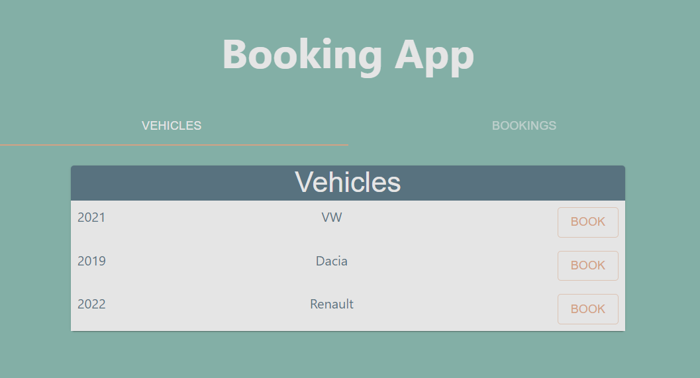

# Booking App

A simple PoC-like app for booking various business-related resources (cars, offices).



## Running the application

On the FE (from `./fe`):
```
npm run start
```

On the BE (from `./be`):
```
npm run start
```

**Note that an instance of MongoDB running on the default location (`localhost:27017`) is assumed!**

_See `package.json` scripts for further commands._

## Design decisions

In general, the app is built with a very lean PoC-approach in mind. For further details on design decisions, see [this document](./design-decisions.md).